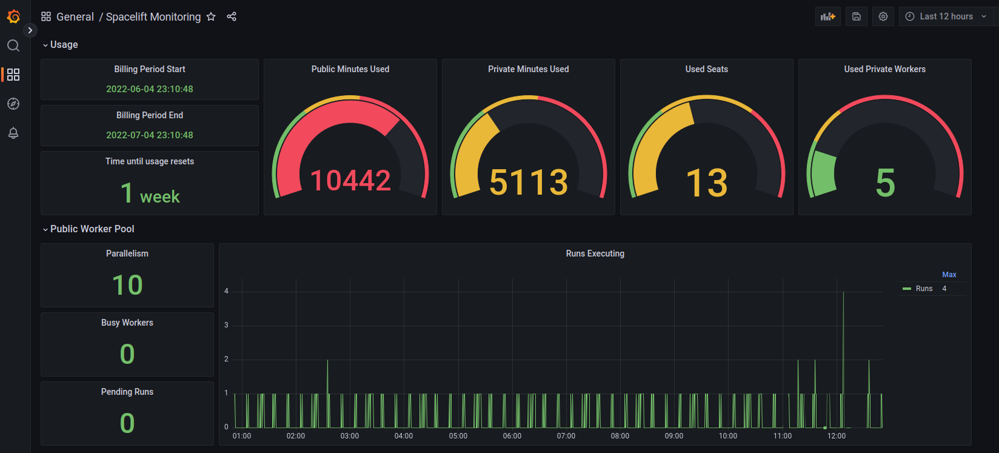

# Spacelift Prometheus Exporter

This repository contains a Prometheus exporter for exporting metrics from your Spacelift account.



## TODO

- Goreleaser.
- Double check against best practices.
- Signal handling.

## Quick Start

The Spacelift exporter is provided as a statically linked Go binary and a Docker container. The
exporter uses
[Spacelift API keys](https://docs.spacelift.io/integrations/api#spacelift-api-key-greater-than-token)
to authenticate, and also needs to know your Spacelift account API endpoint.

Use the following command to run the exporter binary:

```shell
spacelift-promex serve --api-endpoint "https://<account>.app.spacelift.io" --api-key-id "<API Key ID>" --api-key-secret "<API Key Secret>"
```

Use the following command to run the exporter via Docker:

```shell
docker run -it --rm -p 9953:9953 -e "SPACELIFT_PROMEX_API_ENDPOINT=https://<account>.app.spacelift.io" \
  -e "SPACELIFT_PROMEX_API_KEY_ID=<API Key ID>" \
  -e "SPACELIFT_PROMEX_API_KEY_SECRET=<API Key Secret>" \
  adamcspacelift/spacelift-promex
```

### Port Number

By default the exporter listens on port 9953. To change this use the `--listen-address` flag or the
`SPACELIFT_PROMEX_LISTEN_ADDRESS` environment variable:

```shell
spacelift-promex serve --listen-address ":9999" --api-endpoint "https://<account>.app.spacelift.io" --api-key-id "<API Key ID>" --api-key-secret "<API Key Secret>"
```

## Available Metrics

The following metrics are provided by the exporter:

| Metric                                                     | Labels                               | Description                                                                                    |
| ---------------------------------------------------------- | ------------------------------------ | ---------------------------------------------------------------------------------------------- |
| `spacelift_public_worker_pool_runs_pending`                |                                      | The number of runs in your account currently queued and waiting for a public worker            |
| `spacelift_public_worker_pool_workers_busy`                |                                      | The number of currently busy workers in the public worker pool for this account                |
| `spacelift_public_worker_pool_parallelism`                 |                                      | The maximum number of simultaneously executing runs on the public worker pool for this account |
| `spacelift_worker_pool_runs_pending`                       | `worker_pool_id`, `worker_pool_name` | The number of runs currently queued and waiting for a worker from a particular pool            |
| `spacelift_worker_pool_workers_busy`                       | `worker_pool_id`, `worker_pool_name` | The number of currently busy workers in a worker pool                                          |
| `spacelift_worker_pool_workers`                            | `worker_pool_id`, `worker_pool_name` | The number of workers in a worker pool                                                         |
| `spacelift_worker_pool_workers_drained`                    | `worker_pool_id`, `worker_pool_name` | The number of workers in a worker pool that have been drained                                  |
| `spacelift_current_billing_period_start_timestamp_seconds` |                                      | The timestamp of the start of the current billing period                                       |
| `spacelift_current_billing_period_end_timestamp_seconds`   |                                      | The timestamp of the end of the current billing period                                         |
| `spacelift_current_billing_period_used_private_minutes`    |                                      | The number of minutes used in the current billing period                                       |
| `spacelift_current_billing_period_used_public_minutes`     |                                      | The number of minutes used in the current billing period                                       |
| `spacelift_current_billing_period_used_seats`              |                                      | The number of seats used in the current billing period                                         |
| `spacelift_current_billing_period_used_private_workers`    |                                      | The number of private workers used in the current billing period                               |
| `spacelift_scrape_duration`                                |                                      | The duration in seconds of the request to the Spacelift API for metrics                        |
