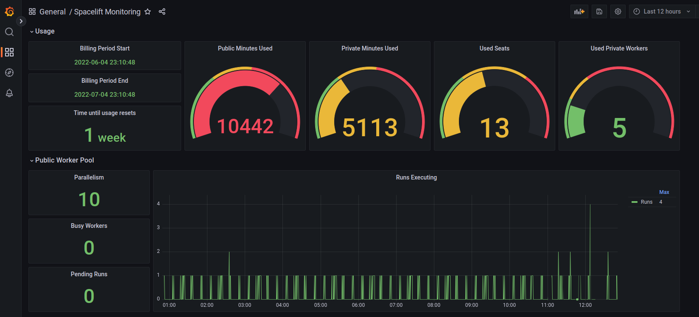

# Spacelift Prometheus Exporter

This repository contains a Prometheus exporter for exporting metrics from your Spacelift account.



## Quick Start

The Spacelift exporter is provided as a statically linked Go binary and a Docker container. You can
find the latest release [here](https://github.com/spacelift-io/prometheus-exporter/releases/latest).
The Docker container is available from our public container registry:
`public.ecr.aws/spacelift/promex`.

### Authentication

The exporter uses
[Spacelift API keys](https://docs.spacelift.io/integrations/api#spacelift-api-key-greater-than-token)
to authenticate, and also needs to know your Spacelift account API endpoint. Your API endpoint is in
the format `https://<account>.app.spacelift.io`, for example `https://my-account.app.spacelift.io`.

**NOTE:** the API key you use must be an Admin key because some of the API fields used for the metrics
require administrative access.

### Running via the Binary

Download the exporter binary from our
[releases](https://github.com/spacelift-io/prometheus-exporter/releases/latest) page, make sure it's
added to your PATH, and then use the `spacelift-promex serve` command to run the exporter binary:

```shell
spacelift-promex serve --api-endpoint "https://<account>.app.spacelift.io" --api-key-id "<API Key ID>" --api-key-secret "<API Key Secret>"
```

### Running via Docker

Use the following command to run the exporter via Docker:

```shell
docker run -it --rm -p 9953:9953 -e "SPACELIFT_PROMEX_API_ENDPOINT=https://<account>.app.spacelift.io" \
  -e "SPACELIFT_PROMEX_API_KEY_ID=<API Key ID>" \
  -e "SPACELIFT_PROMEX_API_KEY_SECRET=<API Key Secret>" \
  public.ecr.aws/spacelift/promex
```

### Running in Kubernetes

You can use the following Deployment definition to run the exporter:

```yaml
apiVersion: apps/v1
kind: Deployment
metadata:
  name: spacelift-promex
  labels:
    app: spacelift-promex
spec:
  replicas: 1
  selector:
    matchLabels:
      app: spacelift-promex
  template:
    metadata:
      labels:
        app: spacelift-promex
    spec:
      containers:
        - name: spacelift-promex
          image: public.ecr.aws/spacelift/promex:latest
          ports:
            - name: metrics
              containerPort: 9953
          readinessProbe:
            httpGet:
              path: /health
              port: metrics
            periodSeconds: 5
          env:
            - name: "SPACELIFT_PROMEX_API_ENDPOINT"
              value: "" # Add your endpoint here
            - name: "SPACELIFT_PROMEX_API_KEY_ID"
              value: "" # Add your API key here
            - name: "SPACELIFT_PROMEX_API_KEY_SECRET"
              value: "" # Add your secret here
            - name: "SPACELIFT_PROMEX_LISTEN_ADDRESS"
              value: ":9953"
```

To use the example deployment, make sure you fill in the API endpoint, API Key ID and API Key
Secret, as explained in the comments. For a production deployment we would recommend making use of
Kubernetes secrets rather than embedding the API key values directly.

## Port Number

By default the exporter listens on port 9953. To change this use the `--listen-address` flag or the
`SPACELIFT_PROMEX_LISTEN_ADDRESS` environment variable:

```shell
spacelift-promex serve --listen-address ":9999" --api-endpoint "https://<account>.app.spacelift.io" --api-key-id "<API Key ID>" --api-key-secret "<API Key Secret>"
```

## Custom CA Certificate

If your Spacelift endpoint uses a certificate chain that is not trusted by system CAs, you can add
an extra trusted root certificate with `--ca-cert-path` or `SPACELIFT_PROMEX_CA_CERT_PATH`.
The exporter keeps system CAs and appends the certificate from the path you provide.

```shell
spacelift-promex serve --ca-cert-path "/certs/spacelift-ca.crt" --api-endpoint "https://<account>.app.spacelift.io" --api-key-id "<API Key ID>" --api-key-secret "<API Key Secret>"
```

## Help

To get information about all the available commands and options, use the `help` command:

```shell
$ spacelift-promex help
NAME:
   spacelift-promex - Exports metrics from your Spacelift account to Prometheus

USAGE:
   spacelift-promex [global options] command [command options] [arguments...]

VERSION:
   0.0.1

COMMANDS:
   serve    Starts the Prometheus exporter
   help, h  Shows a list of commands or help for one command

GLOBAL OPTIONS:
   --help, -h     show help (default: false)
   --version, -v  print the version (default: false)


COPYRIGHT:
   Copyright (c) 2022 spacelift-io
```

To get information about an individual command, use the `--help` flag:

```shell
$ spacelift-promex serve --help
NAME:
   spacelift-promex serve - Starts the Prometheus exporter

USAGE:
   spacelift-promex serve [command options] [arguments...]

OPTIONS:
   --api-endpoint value, -e value    Your spacelift API endpoint (e.g. https://myaccount.app.spacelift.io) [$SPACELIFT_PROMEX_API_ENDPOINT]
   --ca-cert-path value              Path to a PEM-encoded CA certificate to trust in addition to system certificates [$SPACELIFT_PROMEX_CA_CERT_PATH]
   --api-key-id value, -k value      Your spacelift API key ID [$SPACELIFT_PROMEX_API_KEY_ID]
   --api-key-secret value, -s value  Your spacelift API key secret [$SPACELIFT_PROMEX_API_KEY_SECRET]
   --is-development, -d              Uses settings appropriate during local development (default: false) [$SPACELIFT_PROMEX_IS_DEVELOPMENT]
   --listen-address value, -l value  The address to listen on for HTTP requests (default: ":9953") [$SPACELIFT_PROMEX_LISTEN_ADDRESS]
   --scrape-timeout value, -t value  The maximum duration to wait for a response from the Spacelift API during scraping (default: 5s) [$SPACELIFT_PROMEX_SCRAPE_TIMEOUT]
```

## Version

To get version information, use the `--version` flag:

```shell
$ spacelift-promex --version
spacelift-promex version 0.0.1
```

## Available Metrics

The following metrics are provided by the exporter:

| Metric                                                     | Labels                               | Description                                                                                    |
| ---------------------------------------------------------- | ------------------------------------ | ---------------------------------------------------------------------------------------------- |
| `spacelift_public_worker_pool_runs_pending`                |                                      | The number of runs in your account currently queued and waiting for a public worker            |
| `spacelift_public_worker_pool_workers_busy`                |                                      | The number of currently busy workers in the public worker pool for this account                |
| `spacelift_public_worker_pool_parallelism`                 |                                      | The maximum number of simultaneously executing runs on the public worker pool for this account |
| `spacelift_worker_pool_runs_pending`                       | `worker_pool_id`, `worker_pool_name` | The number of runs currently queued and waiting for a worker from a particular pool            |
| `spacelift_worker_pool_workers_busy`                       | `worker_pool_id`, `worker_pool_name` | The number of currently busy workers in a worker pool                                          |
| `spacelift_worker_pool_workers`                            | `worker_pool_id`, `worker_pool_name` | The number of workers in a worker pool                                                         |
| `spacelift_worker_pool_workers_drained`                    | `worker_pool_id`, `worker_pool_name` | The number of workers in a worker pool that have been drained                                  |
| `spacelift_current_billing_period_start_timestamp_seconds` |                                      | The timestamp of the start of the current billing period                                       |
| `spacelift_current_billing_period_end_timestamp_seconds`   |                                      | The timestamp of the end of the current billing period                                         |
| `spacelift_current_billing_period_used_private_seconds`    |                                      | The amount of private worker usage in the current billing period                               |
| `spacelift_current_billing_period_used_public_seconds`     |                                      | The amount of public worker usage in the current billing period                                |
| `spacelift_current_billing_period_used_seats`              |                                      | The number of seats used in the current billing period                                         |
| `spacelift_current_stacks_count_by_state`                  | `state`                              | The number of stacks grouped by state                                                          |
| `spacelift_current_resources_count_by_drift`               | `state`                              | The number of resources by drift                                                               |
| `spacelift_current_avg_stack_size_by_resource_count`       |                                      | The average stack size by resource count                                                       |
| `spacelift_current_max_stack_size_by_resource_count`       |                                      | The maximum stack size by resource count                                                       |
| `spacelift_current_average_run_duration`                   |                                      | The average run duration                                                                       |
| `spacelift_current_median_run_duration`                    |                                      | The median run duration                                                                        |
| `spacelift_current_drift_detection_coverage`               |                                      | Drift detection coverage across stacks                                                         |
| `spacelift_current_resources_count_by_vendor`              | `vendor`                             | The number of resources grouped by vendor                                                      |
| `spacelift_current_has_stacks`                             |                                      | Whether the account has any stacks (1) or not (0)                                              |
| `spacelift_current_has_runs`                               |                                      | Whether the account has any runs (1) or not (0)                                                |
| `spacelift_public_worker_pool_users`                       |                                      | The number of stacks/modules using the public worker pool                                      |
| `spacelift_public_worker_pool_intent_projects`             |                                      | The number of intent projects using the public worker pool                                     |
| `spacelift_public_worker_pool_runs_schedulable`            |                                      | The number of schedulable runs on the public worker pool for this account                      |
| `spacelift_worker_pool_runs_schedulable`                   | `worker_pool_id`, `worker_pool_name` | The number of schedulable runs on a worker pool                                                |
| `spacelift_worker_pool_users`                              | `worker_pool_id`, `worker_pool_name` | The number of stacks/modules using a worker pool                                               |
| `spacelift_worker_pool_notifications`                      | `worker_pool_id`, `worker_pool_name` | The number of new notifications on a worker pool                                               |
| `spacelift_worker_pool_intent_projects`                    | `worker_pool_id`, `worker_pool_name` | The number of intent projects using a worker pool                                              |
| `spacelift_worker_pool_drift_detection_run_limit`          | `worker_pool_id`, `worker_pool_name` | Maximum drift detection runs that can be scheduled on a worker pool (negative = no limit)      |
| `spacelift_worker_pool_managed_by_k8s_controller`          | `worker_pool_id`, `worker_pool_name` | Whether a worker pool is managed by the Kubernetes WorkerPool controller (1) or not (0)        |
| `spacelift_current_billing_period_allowed_seconds`         |                                      | The number of seconds that can be used within the current billing period                       |
| `spacelift_current_billing_period_allowed_seats`           |                                      | The number of seats allowed within the current billing period                                  |
| `spacelift_current_billing_period_used_seconds`            |                                      | The total amount of worker usage in the current billing period                                 |
| `spacelift_current_billing_period_used_workers`            |                                      | Maximum number of concurrent self-hosted workers in the current billing period                 |
| `spacelift_seats_limit`                                    | `type`                               | The total number of seats available (-1 means unlimited)                                       |
| `spacelift_seats_in_use`                                   | `type`                               | The number of seats currently in use                                                           |
| `spacelift_integrations_count`                             | `integration`                        | The number of integrations grouped by type                                                     |
| `spacelift_audit_trail_retention_days`                     |                                      | How many days built-in audit trails are stored                                                 |
| `spacelift_run_log_retention_days`                         |                                      | How many days run logs are retained                                                            |
| `spacelift_largest_stack_resources`                        | `stack_slug`, `stack_name`, `stack_state` | Resource count for each of the largest stacks (top-N as returned by the API)              |
| `spacelift_runs_needing_approval`                          |                                      | The number of runs currently needing approval                                                  |
| `spacelift_runs_requiring_attention`                       |                                      | The number of runs requiring attention                                                         |
| `spacelift_drift_detection_schedules_upcoming`             |                                      | The number of upcoming drift detection schedules                                               |
| `spacelift_scrape_duration`                                |                                      | The duration in seconds of the request to the Spacelift API for metrics                        |
| `spacelift_build_info`                                     |                                      | Contains build information about the exporter (version, commit, etc)                           |

## Example Dashboard

If you're looking for inspiration, you can find an example Grafana dashboard
[here](examples/example-dashboard.json).
