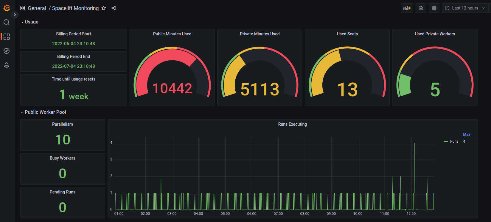

# Spacelift Prometheus Exporter

This repository contains a Prometheus exporter for exporting metrics from your Spacelift account.



## Quick Start

The Spacelift exporter is provided as a statically linked Go binary and a Docker container. You can
find the latest release [here](https://github.com/spacelift-io/prometheus-exporter/releases/latest).
The Docker container is available from our public container registry:
`public.ecr.aws/spacelift/promex`.

### Authentication

The exporter uses
[Spacelift API keys](https://docs.spacelift.io/integrations/api#spacelift-api-key-greater-than-token)
to authenticate, and also needs to know your Spacelift account API endpoint. Your API endpoint is in
the format `https://<account>.app.spacelift.io`, for example `https://my-account.app.spacelift.io`.

On current Spacelift SaaS, an API key needs read access to the root space to use every default
collector. A key without that access cannot use the `usage` collector; grant root-space read,
disable it with `--no-collector.usage`, or use `--partial-scrapes` to retain metrics from the other
collectors.

Self-Hosted releases older than August 2026 also restrict `publicWorkerPool`, `usage` and `metrics`
to non-machine keys. With `--partial-scrapes`, the affected collectors report
`spacelift_scrape_collector_supported=0` and private worker-pool metrics remain available. In the
default strict mode, any unsupported collector makes the whole scrape return HTTP 500, so disable
the affected collectors if you need to retain private worker-pool metrics with a machine key.

#### OIDC API keys with rotating secrets

If your API key is configured for OIDC (the key ID has the form `oidc::<issuer>::<key-id>`), the
"secret" is an OIDC JWT issued by your identity provider rather than a static string. Use
`--api-key-secret-file` (or `SPACELIFT_PROMEX_API_KEY_SECRET_FILE`) to point at the file that holds
the token. The file is re-read on every token refresh, so projected Kubernetes service-account
tokens that rotate on disk are picked up automatically without restarting the exporter.

### Running via the Binary

Download the exporter binary from our
[releases](https://github.com/spacelift-io/prometheus-exporter/releases/latest) page, make sure it's
added to your PATH, and then use the `spacelift-promex serve` command to run the exporter binary:

```shell
spacelift-promex serve --api-endpoint "https://<account>.app.spacelift.io" --api-key-id "<API Key ID>" --api-key-secret "<API Key Secret>"
```

### Running via Docker

Use the following command to run the exporter via Docker:

```shell
docker run -it --rm -p 9953:9953 -e "SPACELIFT_PROMEX_API_ENDPOINT=https://<account>.app.spacelift.io" \
  -e "SPACELIFT_PROMEX_API_KEY_ID=<API Key ID>" \
  -e "SPACELIFT_PROMEX_API_KEY_SECRET=<API Key Secret>" \
  public.ecr.aws/spacelift/promex
```

### Running in Kubernetes

You can use the following Deployment definition to run the exporter:

```yaml
apiVersion: apps/v1
kind: Deployment
metadata:
  name: spacelift-promex
  labels:
    app: spacelift-promex
spec:
  replicas: 1
  selector:
    matchLabels:
      app: spacelift-promex
  template:
    metadata:
      labels:
        app: spacelift-promex
    spec:
      containers:
        - name: spacelift-promex
          image: public.ecr.aws/spacelift/promex:latest
          ports:
            - name: metrics
              containerPort: 9953
          readinessProbe:
            httpGet:
              path: /health
              port: metrics
            periodSeconds: 5
          env:
            - name: "SPACELIFT_PROMEX_API_ENDPOINT"
              value: "" # Add your endpoint here
            - name: "SPACELIFT_PROMEX_API_KEY_ID"
              value: "" # Add your API key here
            - name: "SPACELIFT_PROMEX_API_KEY_SECRET"
              value: "" # Add your secret here
            - name: "SPACELIFT_PROMEX_LISTEN_ADDRESS"
              value: ":9953"
```

To use the example deployment, make sure you fill in the API endpoint, API Key ID and API Key
Secret, as explained in the comments. For a production deployment we would recommend making use of
Kubernetes secrets rather than embedding the API key values directly.

## Port Number

By default the exporter listens on port 9953. To change this use the `--listen-address` flag or the
`SPACELIFT_PROMEX_LISTEN_ADDRESS` environment variable:

```shell
spacelift-promex serve --listen-address ":9999" --api-endpoint "https://<account>.app.spacelift.io" --api-key-id "<API Key ID>" --api-key-secret "<API Key Secret>"
```

## Custom CA Certificate

If your Spacelift endpoint uses a certificate chain that is not trusted by system CAs, you can add
an extra trusted root certificate with `--ca-cert-path` or `SPACELIFT_PROMEX_CA_CERT_PATH`.
The exporter keeps system CAs and appends the certificate from the path you provide.

```shell
spacelift-promex serve --ca-cert-path "/certs/spacelift-ca.crt" --api-endpoint "https://<account>.app.spacelift.io" --api-key-id "<API Key ID>" --api-key-secret "<API Key Secret>"
```

## Help

To get information about all the available commands and options, use the `help` command:

```shell
$ spacelift-promex help
NAME:
   spacelift-promex - Exports metrics from your Spacelift account to Prometheus

USAGE:
   spacelift-promex [global options] command [command options] [arguments...]

VERSION:
   0.0.1

COMMANDS:
   serve    Starts the Prometheus exporter
   help, h  Shows a list of commands or help for one command

GLOBAL OPTIONS:
   --help, -h     show help (default: false)
   --version, -v  print the version (default: false)


COPYRIGHT:
   Copyright (c) 2022 spacelift-io
```

To get information about an individual command, use the `--help` flag:

```shell
$ spacelift-promex serve --help
NAME:
   spacelift-promex serve - Starts the Prometheus exporter

USAGE:
   spacelift-promex serve [options]

OPTIONS:
   --listen-address string, -l string      The address to listen on for HTTP requests (default: ":9953") [$SPACELIFT_PROMEX_LISTEN_ADDRESS]
   --api-endpoint string, -e string        Your spacelift API endpoint (e.g. https://myaccount.app.spacelift.io) [$SPACELIFT_PROMEX_API_ENDPOINT]
   --ca-cert-path string                   Path to a PEM-encoded CA certificate to trust in addition to system certificates [$SPACELIFT_PROMEX_CA_CERT_PATH]
   --api-key-id string, -k string          Your spacelift API key ID [$SPACELIFT_PROMEX_API_KEY_ID]
   --is-development, -d                    Uses settings appropriate during local development [$SPACELIFT_PROMEX_IS_DEVELOPMENT]
   --scrape-timeout duration, -t duration  The maximum duration to wait for a response from the Spacelift API during scraping (default: 5s) [$SPACELIFT_PROMEX_SCRAPE_TIMEOUT]
   --partial-scrapes                       Return healthy collector metrics when another collector fails. Complete API failures still return HTTP 500 [$SPACELIFT_PROMEX_PARTIAL_SCRAPES]
   --[no-]collector.aggregates             Enable the aggregates collector (default: true) [$SPACELIFT_PROMEX_COLLECTOR_AGGREGATES]
   --[no-]collector.publicworkerpool       Enable the publicworkerpool collector (default: true) [$SPACELIFT_PROMEX_COLLECTOR_PUBLICWORKERPOOL]
   --[no-]collector.usage                  Enable the usage collector (default: true) [$SPACELIFT_PROMEX_COLLECTOR_USAGE]
   --[no-]collector.workerpools            Enable the workerpools collector (default: true) [$SPACELIFT_PROMEX_COLLECTOR_WORKERPOOLS]
   --help, -h                              show help
   --api-key-secret string, -s string      Your spacelift API key secret. Mutually exclusive with --api-key-secret-file. [$SPACELIFT_PROMEX_API_KEY_SECRET]
   --api-key-secret-file string            Path to a file containing the spacelift API key secret. The file is re-read on every token refresh, so this is the right choice for rotating secrets such as Kubernetes projected service-account tokens used with OIDC API keys. Mutually exclusive with --api-key-secret. [$SPACELIFT_PROMEX_API_KEY_SECRET_FILE]
```

## Version

To get version information, use the `--version` flag:

```shell
$ spacelift-promex --version
spacelift-promex version 0.0.1
```

## Collector Configuration and Failures

The `aggregates`, `publicworkerpool`, `usage`, and `workerpools` collectors are enabled by default.
Use `--no-collector.<name>` to disable one, or its corresponding
`SPACELIFT_PROMEX_COLLECTOR_<NAME>=false` environment variable. Unknown collector flags are rejected
at startup rather than silently ignored.

Each scrape runs the enabled collectors concurrently under one `--scrape-timeout` deadline. By
default, an error or unsupported result from any enabled collector preserves the exporter's existing
HTTP 500 behavior. This keeps existing `up == 0` alerts working after an upgrade.

Set `--partial-scrapes` (or `SPACELIFT_PROMEX_PARTIAL_SCRAPES=true`) to return the available metrics
and collector health series. It returns HTTP 500 only when one or more collectors genuinely fail and
no supported collector succeeds; an unsupported-only scrape returns HTTP 200. In partial mode, alert
on individual collector failures as well as the target itself:

```promql
spacelift_scrape_collector_success == 0
```

`spacelift_scrape_collector_supported == 0` means the deployment, tier, or API key cannot supply
that collector's data. It does not mean the request itself failed. Disabled collectors emit no
collector health series.

## Available Metrics

The following metrics are provided by the exporter:

| Metric                                                     | Labels                               | Description                                                                                    |
| ---------------------------------------------------------- | ------------------------------------ | ---------------------------------------------------------------------------------------------- |
| `spacelift_public_worker_pool_runs_pending`                |                                      | The number of runs in your account currently queued and waiting for a public worker            |
| `spacelift_public_worker_pool_workers_busy`                |                                      | The number of currently busy workers in the public worker pool for this account                |
| `spacelift_public_worker_pool_parallelism`                 |                                      | The maximum number of simultaneously executing runs on the public worker pool for this account |
| `spacelift_worker_pool_runs_pending`                       | `worker_pool_id`, `worker_pool_name` | The number of runs currently queued and waiting for a worker from a particular pool            |
| `spacelift_worker_pool_workers_busy`                       | `worker_pool_id`, `worker_pool_name` | The number of currently busy workers in a worker pool                                          |
| `spacelift_worker_pool_workers`                            | `worker_pool_id`, `worker_pool_name` | The number of workers in a worker pool                                                         |
| `spacelift_worker_pool_workers_drained`                    | `worker_pool_id`, `worker_pool_name` | The number of workers in a worker pool that have been drained                                  |
| `spacelift_current_billing_period_start_timestamp_seconds` |                                      | The timestamp of the start of the current billing period                                       |
| `spacelift_current_billing_period_end_timestamp_seconds`   |                                      | The timestamp of the end of the current billing period                                         |
| `spacelift_current_billing_period_used_private_seconds`    |                                      | The amount of private worker usage in the current billing period                               |
| `spacelift_current_billing_period_used_public_seconds`     |                                      | The amount of public worker usage in the current billing period                                |
| `spacelift_current_billing_period_used_seats`              |                                      | The number of seats used in the current billing period                                         |
| `spacelift_current_stacks_count_by_state`                  | `state`                              | The number of stacks grouped by state                                                          |
| `spacelift_current_resources_count_by_drift`               | `state`                              | The number of resources by drift                                                               |
| `spacelift_current_avg_stack_size_by_resource_count`       |                                      | The average stack size by resource count                                                       |
| `spacelift_current_average_run_duration`                   |                                      | The average run duration                                                                       |
| `spacelift_current_median_run_duration`                    |                                      | The median run duration                                                                        |
| `spacelift_scrape_collector_success`                       | `collector`                          | Whether the collector succeeded on the last scrape                                             |
| `spacelift_scrape_collector_supported`                     | `collector`                          | Whether the collector is available for this deployment, tier, and API key                      |
| `spacelift_scrape_collector_duration_seconds`              | `collector`                          | The duration of the collector's Spacelift API request on the last scrape                       |
| `spacelift_scrape_duration_seconds`                        |                                      | The duration in seconds of the request to the Spacelift API for metrics (wall time of the whole scrape; collectors query concurrently) |
| `spacelift_build_info`                                     |                                      | Contains build information about the exporter (version, commit, etc)                           |

## Example Dashboard

If you're looking for inspiration, you can find an example Grafana dashboard
[here](examples/example-dashboard.json).
